<div align="center">
  

  <h1>Freecat Blog</h1>

  <p>Write locally, back up with GitHub, and deploy a personal blog for free</p>

  <p><a href="README.md">简体中文</a> | English</p>

  <p>
    
    
    
    
  </p>

  <p>
    <a href="https://freecat-blog.pages.dev">Live Demo 01</a> |
    <a href="https://freecat-blog-op.pages.dev">Live Demo 02</a>
  </p>
</div>

## What Is Freecat Blog

A personal blog template that turns local Markdown articles into a website automatically — no server to buy, no backend to maintain, no code to write. Your original articles stay on your computer and in your GitHub repository, ready to back up, migrate, or switch platforms anytime.

```text
Your computer: write in writing/ and edit site settings in Control/
        ↓
GitHub Desktop syncs changes to GitHub (automatic backup)
        ↓
Cloudflare Pages / Vercel builds automatically
        ↓
Your blog website updates automatically
```

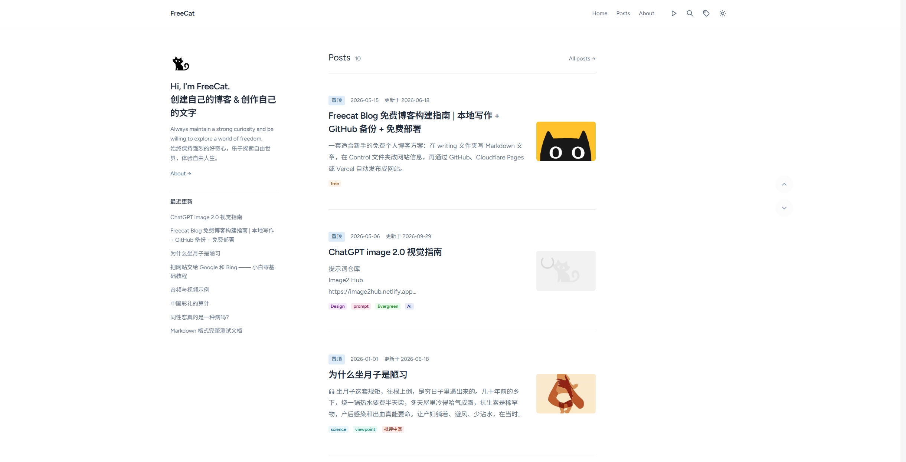

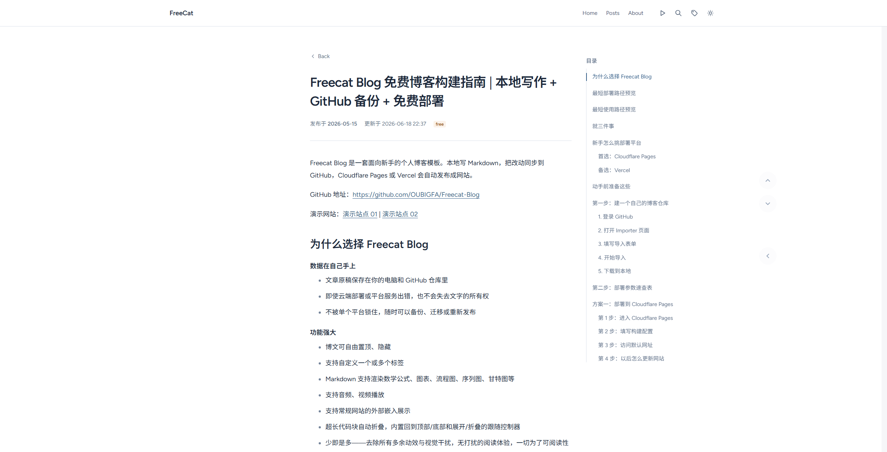

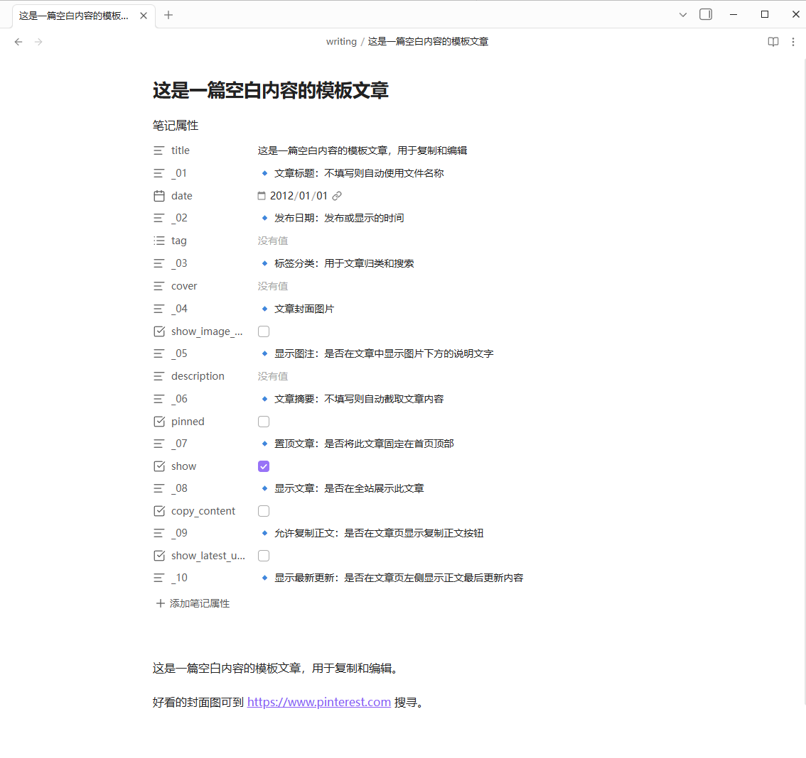

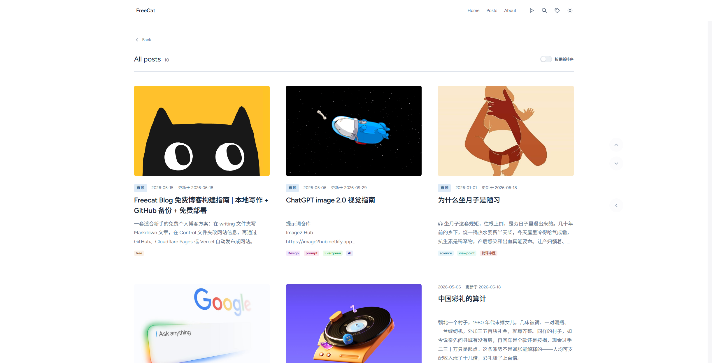

What you get:

- Auto-generated home page, article pages, archive, search page, and About page
- Articles support tags, covers, summaries, pinning, and show/hide; publish with no metadata at all
- Markdown renders math formulas, diagrams, flowcharts, and Gantt charts; embed audio, video, and external pages in articles
- Automatic spacing for mixed Chinese/English text; long code blocks auto-collapse
- Built-in SEO and AI discovery support: Sitemap, RSS, and llms.txt — see `Control/SEO_搜索优化.md`
- Site name, avatar, social links, and theme customization without writing a single line of code
- No unnecessary animations or visual noise — a minimal reading experience built for readability

## The Three Folders You Need to Know

| Folder | Edit often? | Purpose |
| --- | --- | --- |
| `writing/` | Yes | Blog articles. One Markdown file is one article |
| `Control/` | Yes | Site name, avatar, home intro, social links |
| `all/` | No | Build project directory; deployment platforms build from here — leave it alone |

**Write articles in** `writing/`, edit site information in `Control/`, and set the deployment root directory to `all`.

## Deployment

Two things only: copy the template into your own GitHub repository → connect it to a deployment platform. Free, about 10 minutes.

### Preparation

| Tool / Account | Required? | Purpose | Link |
| --- | --- | --- | --- |
| GitHub account | Required | Stores your blog repository | <https://github.com/signup> |
| GitHub Desktop | Required | Syncs local changes to GitHub | <https://desktop.github.com/download> |
| Markdown editor | Required | Writes articles and edits settings; Obsidian is recommended | <https://obsidian.md/> |
| Cloudflare account | Recommended | Free blog deployment | <https://dash.cloudflare.com/sign-up> |
| Vercel account | Optional | Another free deployment option | <https://vercel.com/signup> |

Choose either Cloudflare Pages or Vercel. Complete beginners should start with Cloudflare Pages.

### Step 1: Create Your Own GitHub Repository

1. Sign in to GitHub and open <https://github.com/new/import>. Fill in the form:

| Field | Value |
| --- | --- |
| `Your old repository's clone URL` | `https://github.com/OUBIGFA/Freecat-Blog` |
| `Owner` | Your GitHub account |
| `Repository name` | Choose a name, such as `my-freecat-blog` |
| `Privacy` | Use `Private` |

2. Click `Begin import` and wait a few seconds to a few minutes. When you see `Your new repository ... is ready`, it succeeded. Open the new repository and confirm you can see the `all/`, `Control/`, and `writing/` folders.
3. Open GitHub Desktop, click `File` -> `Clone repository`, select the imported repository, pick an easy-to-find local location, and click `Clone`.

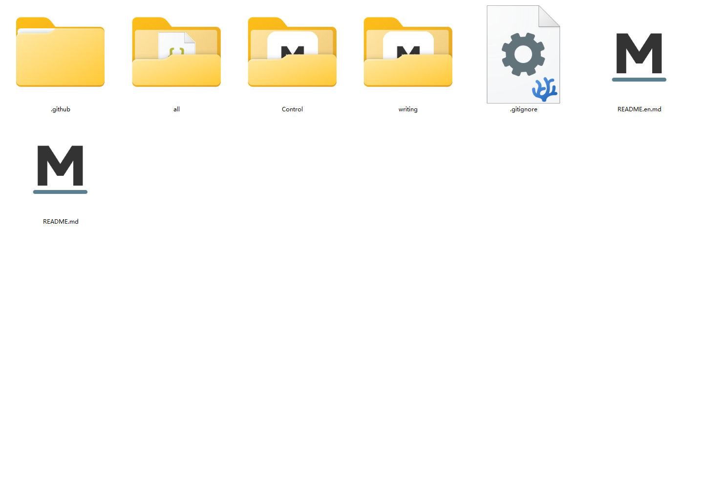

### Step 2: Deploy to Cloudflare Pages (Recommended)

1. Sign in to the [Cloudflare Dashboard](https://dash.cloudflare.com/) and create an application.

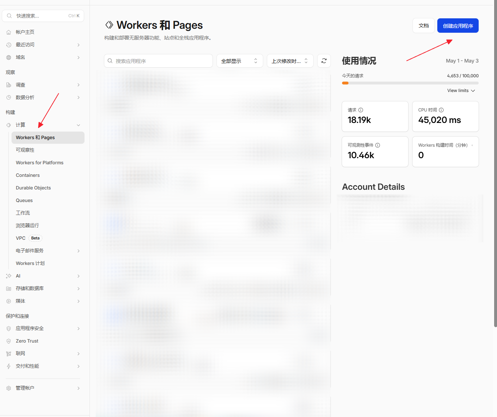

2. Select Pages.

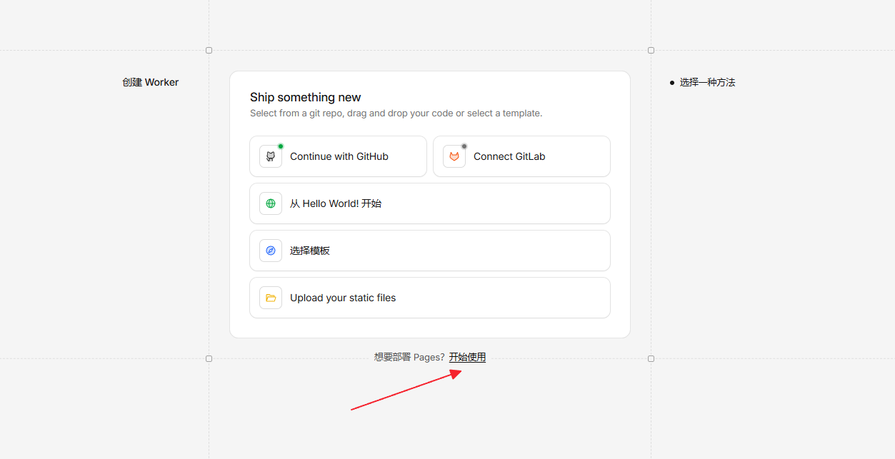

3. Choose "Import an existing Git repository".

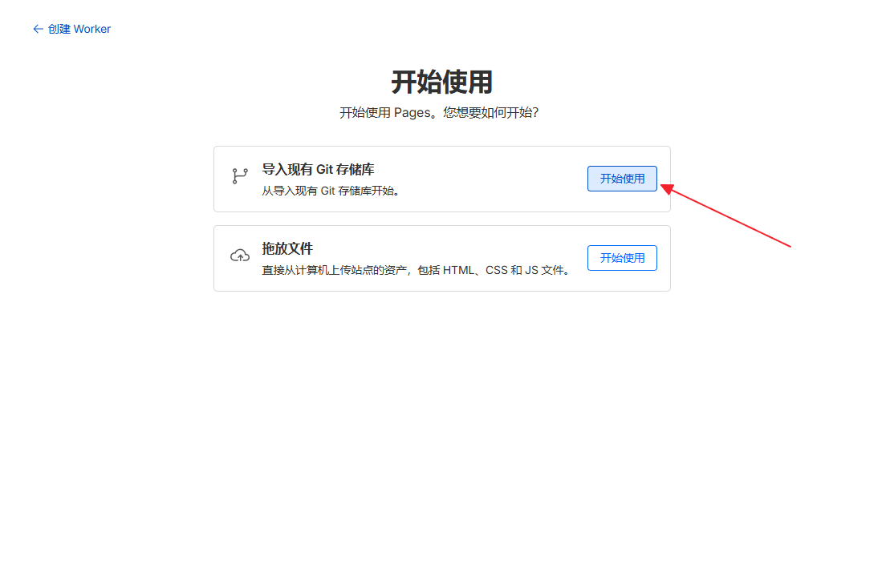

4. Select your own blog repository.

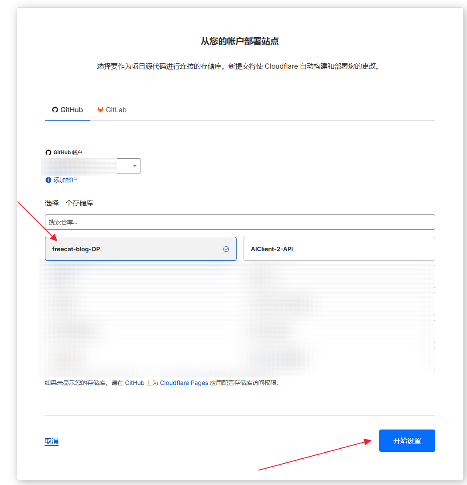

5. The project name is up to you; the key settings are in the table below:

| Cloudflare Chinese UI | Cloudflare English UI | Value |
| --- | --- | --- |
| 框架预设 | Framework preset | `None` / leave unset |
| 根目录（高级） | Root directory (advanced) > Path | `all` |
| 构建命令 | Build command | `npm run build` |
| 构建输出目录 | Build output directory | `dist` |
| 环境变量（建议填写） | Environment variables | `NODE_VERSION` = `20` |

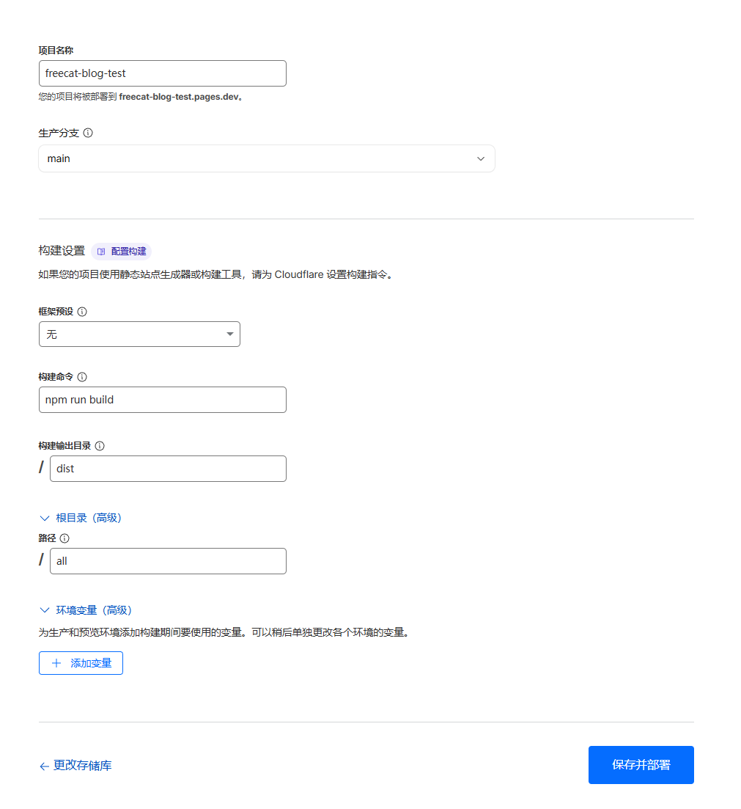

6. Click `Save and Deploy` and wait 1-3 minutes.

> Enable `Build cache` in the project settings: installs finish in seconds once the dependency cache warms up, and expanding the font subsets after articles add new characters only takes seconds — no Python environment required.

7. When the build finishes, open the default URL from Cloudflare (something like `xxx.pages.dev`) and verify.

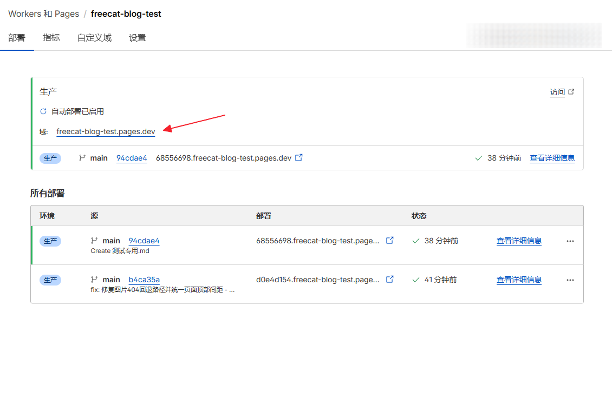

**Common mistakes**:

- Root directory left empty: the platform looks for `package.json` in the repository root, and the build usually fails
- Output directory set to `all/dist`: the root directory is already `all` — just write `dist`
- A random framework preset: this project is not Next.js, Nuxt, or Astro — leave the preset as `None`
- Site not updating: check whether the latest build succeeded in the dashboard first, then force refresh with `Ctrl + F5` — it is usually just browser cache

To use your own domain, bind a custom domain in the Cloudflare Pages project. For free domains, see the [free domain guide](https://blog.freeorg.dpdns.org/posts/%E5%85%8D%E8%B4%B9%E5%9F%9F%E5%90%8D%E7%94%B3%E8%AF%B7%E6%8C%87%E5%8D%97.html) and the [DNSHE auto-renew project](https://github.com/OUBIGFA/dnshe-auto-renew).

### Alternative: Deploy to Vercel

If you already use Vercel, choose it directly. You only change one setting: the Root Directory.

1. Sign in to [Vercel](https://vercel.com/) and click `Add New...` -> `Project`.
2. Connect GitHub and choose your blog repository.
3. On the import page, find `Root Directory` and click `Edit` on the right.

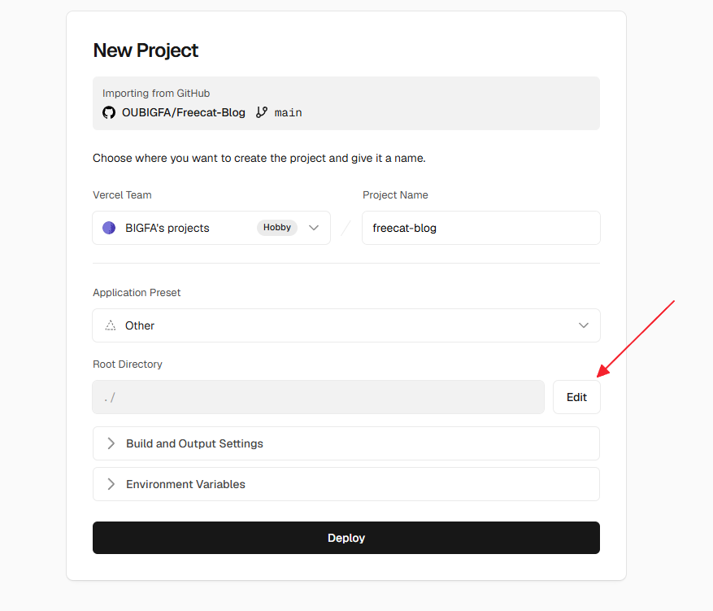

4. In the dialog, select the `all` folder and click `Continue`.

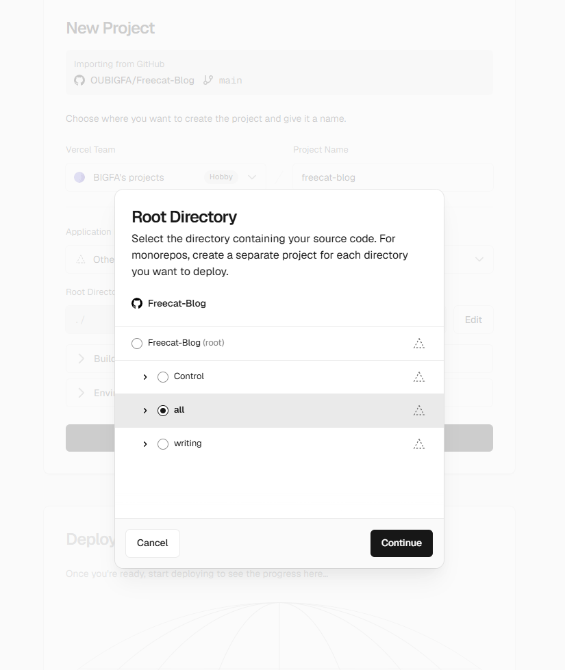

5. Keep every other setting at its default and click `Deploy`.

> The most common mistake: not selecting `all` as the Root Directory, or manually overriding the build settings in `Build and Output Settings`. Either one prevents Vercel from reading `all/vercel.json` in the repository, and every page of the deployed site returns 404. The build command, output directory, and URL rules are all handled by `all/vercel.json` automatically.

Vercel restores its build cache automatically (including font subsets): when articles add no new characters, later deployments skip font generation. Do not clear the Build Cache in project settings unless you intentionally want to force regeneration.

To bind a custom domain, open project settings -> `Domains` and follow the DNS instructions.

## Write Articles: `writing/`

Each `.md` file is one article. The bundled sample articles can be opened to learn the format, copied as templates, or deleted. Opening the repository in Obsidian or VS Code and writing directly works too.

A new article usually starts like this:

```md
---
title: My First Article
date: 2026-01-01
tag:
  - notes
cover:
show_image_captions: true
description:
pinned: false
show: true
copy_content: false
---

Article content starts here.
```

| Field | Purpose | Example |
| --- | --- | --- |
| `title` | Article title; filename is used if empty | `My First Article` |
| `date` | Publish date | `2026-01-01` |
| `tag` | Article tags; multiple allowed | `- notes` |
| `cover` | Cover image URL; empty means no cover | `https://...` |
| `show_image_captions` | Show image captions | `true` / `false` |
| `description` | Article summary; empty means auto excerpt | `A short intro` |
| `pinned` | Pin to top | `true` / `false` |
| `show` | Show on the website | `true` / `false` |
| `copy_content` | Show the copy-content button on the article page | `true` / `false` |

## Customize the Site: `Control/`

| File | Purpose |
| --- | --- |
| `site_网站属性.md` | Site title, site name, home intro, avatar, theme |
| `SEO_搜索优化.md` | Canonical domain, SEO summary, author info, AI crawlers, llms.txt |
| `social_社交媒体.md` | Social icons, profile links, contact methods, promo links |
| `about_关于页面.md` | About page title, intro, and avatar |

Four rules while editing:

- Keep one space after the colon, such as `site_name: FreeCat`
- Leave unused fields empty, but do not delete the whole line
- Lines starting with `_01`, `_02`, etc. are descriptions; do not rename them
- Commit and push with GitHub Desktop after editing, otherwise the live site will not update

What the three common files configure:

- `site_网站属性.md`: site name, description, home title, avatar, favicon, default theme, posts per page, footer copyright. For the theme, only one of `theme_system` / `theme_light` / `theme_dark` may be `true`; if all three are `false`, it falls back to following the system
- `social_社交媒体.md`: each platform has three fields — an enable switch (`github_enabled: true`), a custom icon (`github_icon_url:`, empty means the default icon), and a profile link (`github_url: https://github.com`). Set `*_enabled` to `false` for platforms you do not use
- `about_关于页面.md`: `about_hero_title`, `about_hero_subtitle`, and `about_hero_avatar` set the About page title, intro, and avatar; leaving them empty reuses the corresponding home page content

## Daily Updates (5 Steps)

1. Add or edit articles in `writing/`.
2. Edit site settings in `Control/` if needed.
3. Save the files.
4. Open GitHub Desktop, write a short commit message, and click `Commit to main`.
5. Click `Push origin`.

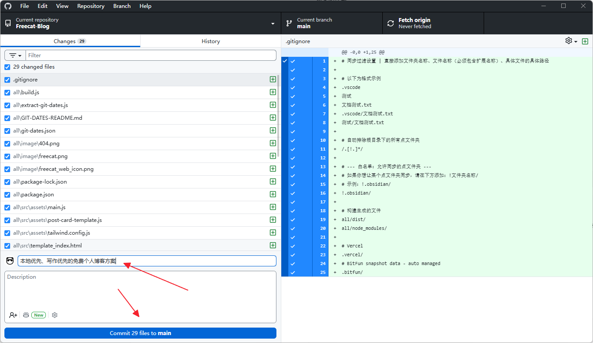

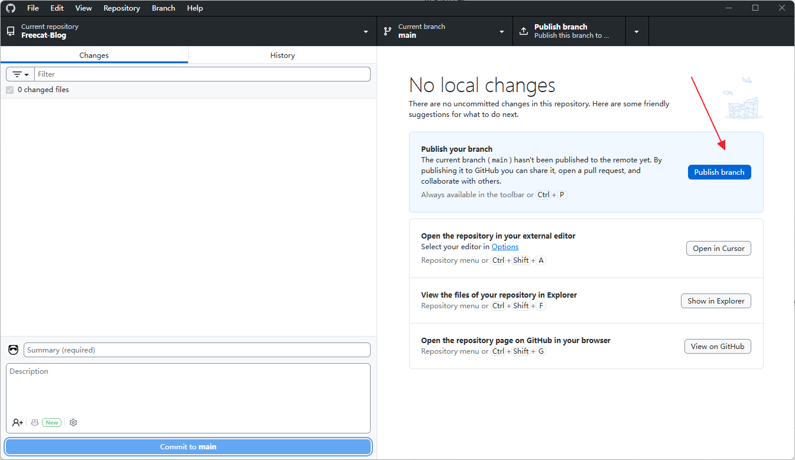

The platform rebuilds automatically after syncing. Refresh the site after 1-3 minutes to see the new content.

## Audio and Video Players

Put a direct file link (not a cloud-drive sharing page) in an article and a player appears automatically:

```md


```

If the link has no obvious audio or video extension, add 🎵 or 🎬 in the title to force detection:

```md


```

Supported formats:

- Audio: `.mp3`, `.m4a`, `.wav`, `.ogg`, `.aac`, `.flac`, `.opus`
- Video: `.mp4`, `.webm`, `.mov`, `.m4v`, `.ogv`, `.m3u8`

To check whether a link works, paste it into the browser address bar. If the browser plays or downloads the file directly, it works. If it opens a cloud-drive page, login page, or extraction-code page, convert it first with the [cloud-drive direct link tool](https://link.gimhoy.com/), the [sharing-link-to-direct-link tool](https://lz.qaiu.top/), or [Feijipan cloud drive](https://www.feijipan.com). Direct links may expire — if a player stops working, convert the link again.

## Template Update Sync

The repository includes a workflow, `.github/workflows/sync-upstream.yml`, that syncs template files from the main repository [OUBIGFA/Freecat-Blog](https://github.com/OUBIGFA/Freecat-Blog) every Tuesday at 02:17 Beijing time and commits them to your `main` branch. The deployment platform rebuilds automatically afterwards.

**Before first use**: open the `Actions` tab in your own repository, enable workflows as GitHub prompts, and make sure the repository Actions permission allows write access — otherwise the sync cannot commit automatically.

| Scope | Content |
| --- | --- |
| Synced | `all/`, `README.md`, `README.en.md` |
| Preserved | `all/git-dates.json`, `all/build/font-subsets-manifest.json`, `all/src/assets/fonts/` |
| Not touched | `Control/`, `writing/`, `.github/`, `.gitignore` |

Your own articles and site settings will not be overwritten; edits to templates, styles, or build scripts inside `all/` may be. Beginners should leave `all/` alone.

To trigger a sync immediately: repository -> `Actions` -> `Sync upstream template files` -> `Run workflow`. The workflow skips the commit when upstream has not changed; scheduled runs may lag a few minutes, which is normal.

> If you run into build issues: go to the main repository, copy the latest [sync-upstream](https://github.com/OUBIGFA/Freecat-Blog/blob/main/.github/workflows/sync-upstream.yml) or [update-git-dates.yml](https://github.com/OUBIGFA/FreeBlog_BIGFA/blob/main/.github/workflows/update-git-dates.yml) workflow file into your repo, and run it manually. It only syncs build files and will not overwrite your settings or articles. To use new features, copy the relevant settings from the main repository's [Control folder](https://github.com/OUBIGFA/Freecat-Blog/tree/main/Control) into your own `Control/`.

## FAQ

**Do I need to know how to code?** No. Day to day, you only write Markdown and edit config files.

**Cloudflare or Vercel?** Complete beginners should choose Cloudflare Pages. If you already use Vercel, Vercel is fine. Your content is on GitHub, so you can migrate anytime.

**Do I have to buy a domain?** No. Both platforms provide a default URL first.

**What is the easiest setting to get wrong?** Root Directory must be `all` and the output directory must be `dist`. Do not write `all/dist`.

**I changed files locally but the site did not update. What now?** Check in order: files are saved -> GitHub Desktop has pushed -> the platform started a new build -> force refresh the browser.

**How do I use `.gitignore`?** It is a "do-not-upload list": add a line like `drafts/` and GitHub Desktop ignores it. It only affects new files that have not been committed yet.

**Can I delete the sample articles?** Yes. Delete them, then commit and push.

**Can I edit `all/` directly?** Not recommended for beginners — `all/` is the template project directory, and automatic upstream sync may overwrite changes there.

## Local Preview (Optional)

If you only write articles, you do not need to build locally — the platform handles it. To preview on your computer: install [Node.js 20+](https://nodejs.org/), then run:

```bash
cd all
npm install
npm run preview
```

This runs a full build first, then starts the local preview at `http://127.0.0.1:4173/`. The output is in `all/dist/`. Do not edit it manually and do not commit it to GitHub.

## License

This project is released under the MIT License.
